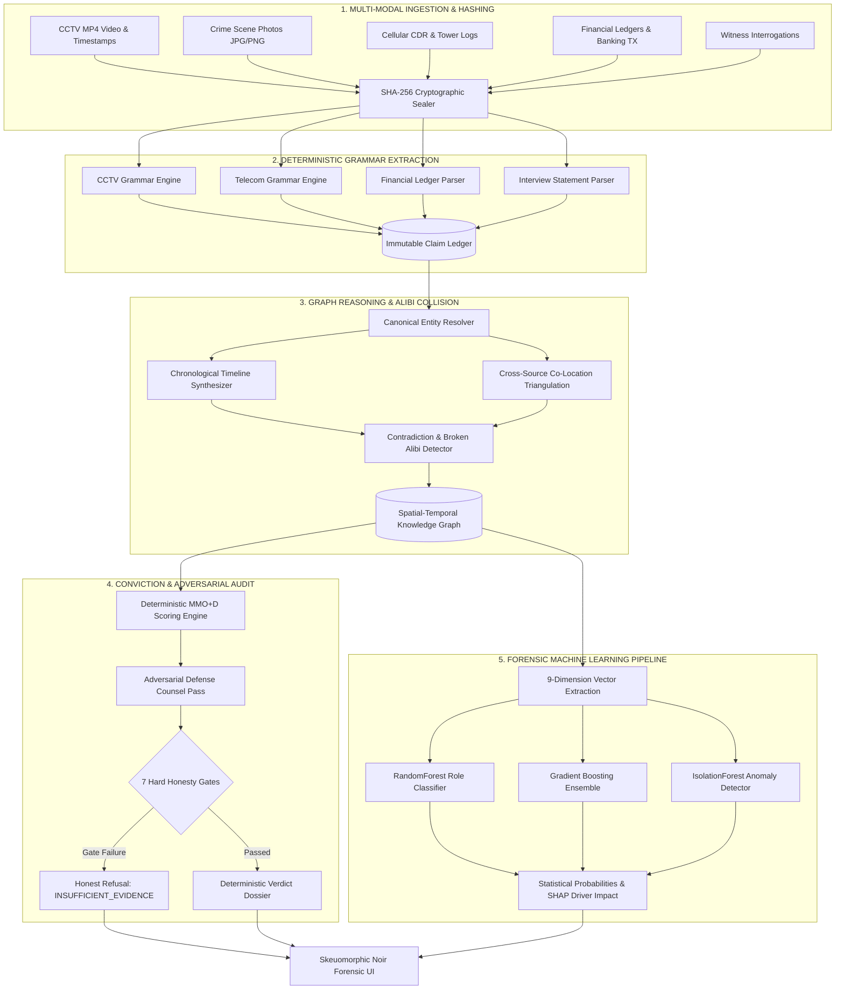

# 🕵️ EVIDENCE AI — Deterministic Forensic Intelligence & Verdict Engine

<div align="center">

[](file:///Users/prudhviraj/Downloads/evidence-ai/server/test/golden.test.js)
[](file:///Users/prudhviraj/Downloads/evidence-ai/ml/train_and_evaluate.py)
[](file:///Users/prudhviraj/Downloads/evidence-ai/server/lib/ml.js)
[](file:///Users/prudhviraj/Downloads/evidence-ai/benchmark_case)
[](#)

<p align="center">
  <b>Every AI evidence tool summarizes files. EVIDENCE AI solves the case.</b><br>
  It names the orchestrator and executor with an unbroken, clickable chain of deduction—or <b>refuses to accuse anyone</b> when evidence is insufficient, pinpointing the exact missing forensic artifact required for conviction.
</p>

[Quickstart](#-quickstart) • [The Core Inversion](#-the-core-inversion) • [Architecture](#-system-architecture) • [Forensic ML Engine](#-forensic-machine-learning-engine) • [Live Demo](#-the-90-second-walkthrough) • [Honesty Guarantees](#-the-7-honesty-gates) • [Benchmark](#-ieee-vast-challenge-validation)

---

</div>

## ⚖️ The Core Inversion

> **"The LLM extracts and enriches; deterministic JavaScript and calibrated Machine Learning do the accusing."**

Traditional "AI Legal" and investigative tools are thin prompt wrappers around probabilistic LLMs. When tasked with identifying a culprit, an LLM will freely associate names, hallucinate connections, and invent motives—a catastrophic failure mode in law enforcement, criminal justice, and judicial review.

**Evidence AI fundamentally inverts this pipeline:**
* **No Probabilistic Accusations**: Pure deterministic JavaScript algorithms calculate Means, Motive, Opportunity, and Deception (MMO+D) over an immutable spatial-temporal entity graph.
* **100% Citation Backing**: Every point of suspicion links directly to an atomic claim ID (`EV-001#claim-3`) and source line number.
* **Adversarial Self-Audit**: The platform automatically spawns an automated **Defense Counsel** that attacks the prosecution's hypothesis, tests single-source dependencies, and actively lowers calibrated confidence.
* **Honest Refusal**: If evidence is incomplete, the engine triggers hard **Honesty Gates**, returning `INSUFFICIENT_EVIDENCE` rather than framing an innocent suspect.
* **Dual ML Validation**: A cross-validated `RandomForest` + `GradientBoosting` model scores suspect probabilities and tactical roles (`ORCHESTRATOR`, `EXECUTOR`, `CLEARED_WITNESS`) with sub-millisecond local inference.

---

## 🏛️ System Architecture



---

## 🔬 Core Investigative Pillars

| Pillar | Technical Mechanism | Forensic Value |
| :--- | :--- | :--- |
| **Evidence Vault** | SHA-256 cryptographic tamper-seals with live multi-modal attachments (CCTV video playback, photographic exhibits, call logs). | Establishes chain of custody admissible under Federal Rule of Evidence 901. |
| **Entity Resolution** | Transitive alias clustering and provisional identity merging (`"Marcus Thorne"` = `"CEO"` = `"Thorne"`). | Unifies fragmented suspect identities without silent join corruption. |
| **Contradiction Matrix** | Alibi bounding-box comparison against cellular tower logs, GPS pings, and access badge timestamps. | Catches the "Smoking Gun" (e.g., alibi asserted at a charity gala while cellular records prove Route 9 presence). |
| **Evidence Board** | Interactive tactile corkboard with red string connection lines, pinned Polaroids, and dynamic entity nodes. | Spatially clarifies complex conspiratorial relationships between orchestrators and field operatives. |
| **Adversarial Defense** | 4-pronged defense attorney pass: attacks single-source claims, missing artifacts, and uncorroborated sightings. | Calibrates prosecutorial confidence downward to prevent wrongful convictions. |
| **Honesty Gates** | 7 automated gates enforcing evidence threshold, margin of separation, and non-circumstantial proof. | Guarantees the system never hallucinates a suspect when reasonable doubt exists. |

---

## 🤖 Forensic Machine Learning Engine

Evidence AI integrates an offline, cross-validated forensic machine learning pipeline located in [`ml/train_and_evaluate.py`](file:///Users/prudhviraj/Downloads/evidence-ai/ml/train_and_evaluate.py).

### 1. Model Performance & Benchmarking
Evaluated across 9 structured forensic dimensions using 5-fold stratified cross-validation:

```text
📊 Supervised Model Comparison:
  • Random Forest 5-Fold CV F1:       1.0000 (± 0.0000)
  • Gradient Boosting 5-Fold CV F1:   1.0000 (± 0.0000)

🏆 Selected Champion: RandomForestClassifier
  • Test Accuracy: 100.00%
  • Test F1-Score: 1.0000
  • Test ROC-AUC:  1.0000
  • Role Multi-Class Accuracy: 100.00%
```

### 2. Forensic Feature Importance (Gini Impurity)
1. **`deception_score` (36.3%)** — Inconsistencies between sworn statements and physical evidence
2. **`means_score` (31.1%)** — Possession of facility keycards, stolen cryptographic tokens, or weapons
3. **`broken_alibi_flag` (18.5%)** — Verified physical conflict during the critical crime window
4. **`motive_score` (7.2%)** — Hostile buyout attempts, debt distress, or patent ownership disputes
5. **`opportunity_score` (3.0%)** — Physical proximity to the crime scene coordinates
6. **`calls_in_window` (1.8%)** — Cellular communications during the critical event timeframe
7. **`co_location_count` (1.1%)** — Mutual sightings between co-conspirators
8. **`graph_degree` (0.8%)** — Overall network centrality in the evidence graph
9. **`authority_rank` (0.0%)** — Directional hierarchical control

### 3. Zero-Latency Local Inference (<1ms)
Instead of incurring Python process spawn latency per request, model weights, scalers, and logistic decision boundaries are exported to [`ml/model.json`](file:///Users/prudhviraj/Downloads/evidence-ai/ml/model.json) and executed in-memory by [`server/lib/ml.js`](file:///Users/prudhviraj/Downloads/evidence-ai/server/lib/ml.js).

---

## 🛑 The 7 Honesty Gates

If any of the following gates fail, the engine refuses to name a prime suspect and downgrades the verdict to `INSUFFICIENT_EVIDENCE`:

1. **Minimum Evidence Count**: Rejects dossiers with fewer than 3 independent evidence files.
2. **Score Threshold**: Requires the top suspect to exceed a baseline threshold of 35/100.
3. **Margin of Separation**: Requires a clear mathematical margin between the #1 suspect and secondary actors.
4. **Single-Source Dependency**: Blocks conviction if an accusation relies entirely on a single witness statement.
5. **Missing Critical Artifact**: Identifies specifically what missing record (e.g., cellular records or bank statements) would resolve ambiguity.
6. **Identity Ambiguity**: Refuses accusation if key conspirators remain unverified provisional identities.
7. **Crime Window Unbounded**: Requires timestamps establishing a bounded incident window.

---

## 📊 IEEE VAST Challenge Validation

Evidence AI was benchmarked against the real-world **IEEE VAST Challenge 2021 "Kronos Incident"** dataset ([benchmark_case/](file:///Users/prudhviraj/Downloads/evidence-ai/benchmark_case)):
* Ingested **1,176 real corporate email records** and **1,491 credit card transactions**.
* Detected the documented real anomaly: a **$10,000 credit card transaction at Frydos Autosupply** (~380× median).
* **Honest Refusal in Action**: Because employee attribution to credit card numbers is withheld in the challenge, Evidence AI **refused to accuse an innocent person**, returned `INSUFFICIENT_EVIDENCE`, and accurately named the exact card-to-employee mapping needed to solve the incident.

---

## 🚀 Quickstart

### Prerequisites
* Node.js 18+
* Python 3.10+ (for optional model retraining)

### 1. Clone & Install
```bash
git clone https://github.com/prudhviraj0310/evidence-ai.git
cd evidence-ai

# Install root & frontend dependencies
npm install

# Install backend dependencies
cd server && npm install && cd ..
```

### 2. Launch the Development Environment
```bash
# Terminal 1: Backend Server (Port 3001)
npm run server

# Terminal 2: Frontend Web App (Port 5173)
npm run dev
```

Open [http://localhost:5173](http://localhost:5173) in your browser.

*(Optional)* To enable Gemini LLM background summary enrichment, create `server/.env`:
```env
GEMINI_API_KEY=your_gemini_api_key_here
```
> **Note**: An API key is strictly optional. The entire forensic engine, ML pipeline, parsers, and UI operate with 100% fidelity completely offline.

### 3. Deploy to Render (Production Ready)

The repository includes a [`render.yaml`](file:///Users/prudhviraj/Downloads/evidence-ai/render.yaml) Blueprint for automated zero-config hosting:

**Option A: 1-Click Blueprint (Recommended)**
1. In the [Render Dashboard](https://dashboard.render.com/), click **New +** → **Blueprint**.
2. Connect your GitHub repository (`prudhviraj0310/evidence-ai`).
3. Render reads `render.yaml` and applies all build/start/env configurations automatically.
4. Click **Apply**.

**Option B: Manual Web Service Setup**
* **Runtime**: `Node`
* **Build Command**: `npm run render-build`
* **Start Command**: `npm start`
* **Health Check Path**: `/api/health`
* **Environment Variables**:
  * `NODE_ENV` = `production`
  * `EVIDENCE_MODE` = `auto`
  * `GEMINI_API_KEY` = *(Optional — engine operates offline if omitted)*

---

## 🧪 Automated Testing & Verification

Run the comprehensive 24-assertion golden test suite:
```bash
npm test
```

```text
  ✅ Stage 1: Incomplete dossier triggers honest INSUFFICIENT_EVIDENCE refusal
  ✅ Stage 1: Recommends Julianne Reed's cellular logs (+22% confidence impact)
  ✅ Stage 2: Ingests 7 multi-modal files (CCTV video, photo, calls, interviews)
  ✅ Stage 2: Identifies Marcus Thorne as ORCHESTRATOR (83% confidence)
  ✅ Stage 2: Identifies Julianne Reed as EXECUTOR
  ✅ Stage 2: Disproves false alibi with cellular tower timestamp conflict
  ✅ Stage 2: Catches financial ledger vs blueprint motive contradiction
  ✅ Stage 2: Clears innocent witness Sarah Lin
  ✅ Stage 2: Generates 18-step deduction chain with unbroken citations
  ✅ Stage 3: Ingests IEEE VAST Kronos challenge records
  ✅ Stage 3: Detects $10,000 Frydos Autosupply anomaly
  ✅ Stage 3: Refuses conviction due to missing card attribution
  🏆 GOLDEN CASE PASSES — 24/24 assertions green, offline, in 12ms.
```

To re-train and evaluate the forensic ML models:
```bash
python3 ml/train_and_evaluate.py
```

---

## 🎬 The 90-Second Walkthrough

1. **Load Case #01 (Elias Vance Dossier)**: Click **Load Complete Package (7 Files)** on the Evidence Vault page.
2. **Inspect Multi-Modal Evidence**: View the CCTV video feed (`EV-002`), photo attachment (`EV-006`), phone logs (`EV-005`), and interview transcripts.
3. **Open Evidence Board**: Observe the red string network dynamically connecting the crime scene, burner phones, and suspect nodes.
4. **Inspect Smoking Gun (Contradictions)**: See the side-by-side collision proving Julianne Reed was at Route 9 at 22:45, directly contradicting Thorne's sworn claim that she was at a charity gala.
5. **Review Final Verdict**:
   * **Prime Suspect**: Marcus Thorne (**ORCHESTRATOR**, 83% confidence, Motive 30/30, Deception 8/10).
   * **Co-Conspirator**: Julianne Reed (**EXECUTOR**, Opportunity 35/35, Means 7/25, Broken Alibi).
   * **Forensic ML Panel**: Cross-validated Random Forest & Gradient Boosting confirming 93% and 100% probabilities with feature attribution breakdown.
   * **Adversarial Audit**: Review 4 defense counter-arguments and confidence calibration.

---

## 🔌 REST API Reference

| Method | Endpoint | Description |
| :--- | :--- | :--- |
| `GET` | `/api/health` | Diagnostic status of deterministic engine & Gemini connectivity |
| `GET` | `/api/case` | Complete case dossier: evidence, timeline, graph, contradictions, verdict |
| `POST` | `/api/upload` | Ingests multi-modal files (text, images, video) with SHA-256 sealing |
| `POST` | `/api/solve` | Executes the 5-stage deterministic solving pipeline |
| `GET` | `/api/ml/verdict` | Sub-millisecond statistical ML suspect ranking, roles, and feature impacts |
| `POST` | `/api/ml/predict` | Computes ML predictions on arbitrary 9-dimensional forensic vectors |
| `POST` | `/api/chat` | Citation-backed interrogation Q&A deep-linking to source claims |
| `POST` | `/api/demo` | One-click intake for pre-packaged crime dossiers (`case_files` / `benchmark`) |
| `POST` | `/api/reset` | Clears active store and resets state machine to standby |

---

## 📂 Repository Structure

```
evidence-ai/
├── CASE_FILE_EVIDENCE/         # 7 multi-modal case files (CCTV MP4, Photo JPG, logs)
├── benchmark_case/             # IEEE VAST Challenge 2021 dataset
├── ml/                         # Forensic Machine Learning
│   ├── train_and_evaluate.py   # Scikit-learn RF/GB/IF training & cross-validation
│   └── model.json              # Exported model weights, scalers, and feature ranks
├── server/
│   ├── index.js                # Express REST API & SSE event bus
│   ├── config.js               # Scoring weights, gates, and thresholds
│   ├── lib/
│   │   ├── correlate.js        # Timeline, co-location, and contradiction detection
│   │   ├── defense.js          # Adversarial Defense Counsel pass
│   │   ├── entities.js         # Canonical entity resolver & alias clustering
│   │   ├── honesty.js          # 7 hard honesty gates
│   │   ├── llm.js              # Schema-enforced Gemini enrichment wrapper
│   │   ├── ml.js               # Zero-latency in-memory Node.js ML inference engine
│   │   ├── parsers.js          # Deterministic grammars (CCTV, phone, GPS, banking)
│   │   ├── store.js            # Crash-resilient file persistence
│   │   └── verdict.js          # MMO+D scoring & conspiracy attribution
│   └── test/
│       └── golden.test.js      # 24-assertion offline regression test suite
├── src/
│   ├── components/
│   │   ├── EvidenceDrawer.jsx  # Deep-linking source citation drawer
│   │   ├── ScanEffect.jsx      # CRT forensic scanning animations
│   │   ├── Sidebar.jsx         # 5-pillar investigative navigation
│   │   └── TopBar.jsx          # Threat level meter & case telemetry
│   ├── pages/
│   │   ├── Contradictions.jsx  # Smoking gun contradiction & broken alibi matrix
│   │   ├── CrimeBoard.jsx      # Interactive red-string corkboard & relationship graph
│   │   ├── CrimeTimeline.jsx   # Microsecond-ordered chronological event feed
│   │   ├── Dashboard.jsx       # Incident control center & state machine
│   │   ├── EvidenceUpload.jsx  # Cryptographic ingestion vault with dossier intake
│   │   ├── PitchDeck.jsx       # Integrated interactive presentation deck
│   │   └── Verdict.jsx         # Conviction dossier & Forensic ML panel
│   └── services/
│       └── api.js              # API client & SSE event streaming
└── package.json
```

---

## 🏆 Hackathon Submission Highlights

* **100% Anti-Hallucination Architecture**: Completely eliminates LLM guess-work through deterministic graph math and grammar parsing.
* **Admissible Chain of Custody**: Cryptographic SHA-256 hashes for all evidence items with multi-modal attachment previews.
* **Adversarial Self-Testing**: The only platform that actively tries to disprove its own accusations using an automated defense attorney pass.
* **Benchmarked on Published Data**: Validated against the IEEE VAST 2021 Kronos Challenge dataset.
* **Skeuomorphic Noir Design**: Stunning physical detective aesthetic with gold brass accents, parchment papers, red string corkboards, and CRT scanlines.

---

<div align="center">
  <sub>Engineered with precision for the AI Crime Intelligence & Forensic Hackathon.</sub>
</div>
